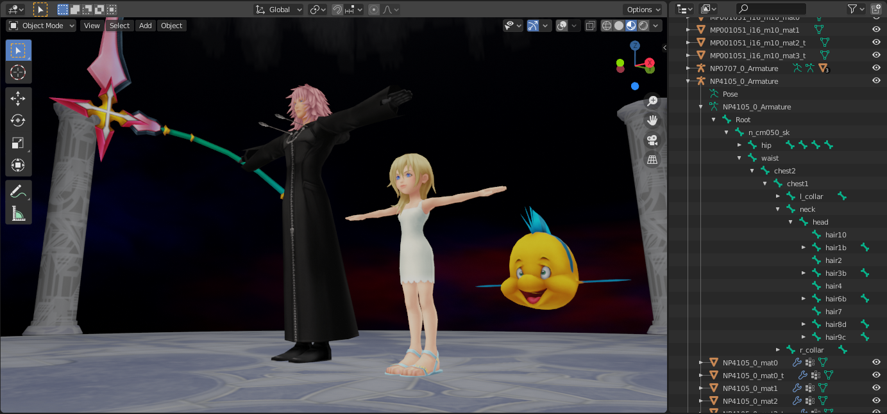

# KH Re:COM Tools

A set of experimental tools for researching Kingdom Hearts Re:Chain of Memories for the PlayStation 2.

## Extractor

Extracts all files from a KH Re:COM disk image (.ISO). Supports both NA and JP releases.

Sample usage:

```khrecom-ps2-extractor.exe C:\path\to\game.iso -d C:\optional\extract\dir```

The default location for extracted files will be a folder named `extract/` in the working directory.

## Resource Unpacker

Extracts files from packed resource file types. To find these files, run the above extractor on the .ISO first. Supported extensions are:

* .ABC, .BIN, .ESD, .EPD, .GSD, .PTD
* .CAP (Camera Data)
* .CTD (Cutscene Data)
* .EFF (Particle Effects)
* .RTM, .VTM (TIM2 Images/Textures)
* .SPR (Sprites)
* .TXA (Animated Textures)
* .SND, .RSD, .VSM (Sound Bank)

Sample usage:

```khrecom-ps2-rsrc-unpacker.exe C:\path\to\resou.rce -d C:\optional\extract\dir```

By default, the unpacker will create a new folder in the working directory with the same name as the original file.

## Blender Add-on



An experimental Blender importer for both stages (.AZF) and models (.MDL). Compatible with Blender 2.8x.

Installation Method A:

1. Locate the add-ons folder for Blender. In Windows, this path is typically: `%appdata%\Blender Foundation\Blender\2.8x\scripts\addons\`
2. Copy the `io_kh_recom\` folder into `addons\`.
3. Open Blender, go to `Edit -> Preferences`, and select the `Add-ons` tab.
4. Ensure the `Community` filter is selected, and locate `Import-Export: Kingdom Hearts Re:Chain of Memories` in the list. Click the checkmark next to this add-on to load it. Close the preferences window.
5. Go to `File -> Import` and select either from the list of file formats:
    * `Kingdom Hearts Re:COM Stage (.azf)`
    * `Kingdom Hearts Re:COM Model (.mdl)`

Installation Method B:

1. Pack the contents of `io_kh_recom\` into a single ZIP file.
2. Open Blender, go to `Edit -> Preferences`, and select the `Add-ons` tab.
3. Click `Install...` and locate the ZIP you created in step 1.
4. Follow steps 4 and 5 in method A.
